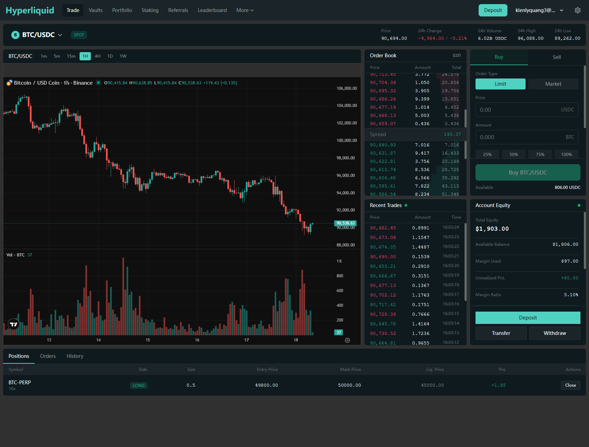

# Hyperliquid Clone - 去中心化交易平台

完整的去中心化交易平台克隆，包含现货和永续合约交易功能。

## 📸 界面预览



*完整的交易界面，包含实时K线图、订单簿、最近成交、交易表单、持仓管理等功能*

## 📋 项目概况

基于 Hyperliquid 交易平台的完整复刻，采用现代化技术栈构建，支持链上交易、实时市场数据、钱包集成等核心功能。

### 技术栈

**前端**
- Vue 3 + Composition API
- TypeScript 5+
- Tailwind CSS 3+
- Pinia (状态管理)
- ECharts (图表)
- ethers.js (Web3)
- Vite (构建工具)

**后端**
- Node.js 18+
- Express.js
- TypeScript
- MySQL 8.0
- Redis 7
- WebSocket (ws)
- JWT 认证

**部署**
- Docker + Docker Compose
- Nginx

## 🚀 快速开始

### 使用 Docker Compose (推荐)

1. **克隆项目**
```bash
git clone <repository-url>
cd coke-hyperliquid
```

2. **配置环境变量**
```bash
cp .env.example .env
# 编辑 .env 文件，修改必要的配置（特别是 JWT_SECRET 和数据库密码）
```

3. **启动所有服务**
```bash
docker-compose up -d
```

4. **访问应用**
- 前端: http://localhost:3000
- 后端 API: http://localhost:4000
- WebSocket: ws://localhost:4001

5. **查看日志**
```bash
docker-compose logs -f
```

6. **停止服务**
```bash
docker-compose down
```

### 本地开发

#### 前端开发

```bash
cd frontend
npm install
npm run dev
```

访问 http://localhost:3000

#### 后端开发

1. **启动 MySQL 和 Redis**
```bash
docker-compose up -d mysql redis
```

2. **初始化数据库**
```bash
mysql -h 127.0.0.1 -u root -p < backend/database/schema.sql
```

3. **配置环境变量**
```bash
cd backend
cp .env.example .env
# 编辑 .env 文件
```

4. **启动后端服务**
```bash
npm install
npm run dev
```

后端 API 运行在 http://localhost:4000
WebSocket 运行在 ws://localhost:4001

## 📁 项目结构

```
coke-hyperliquid/
├── frontend/              # Vue 3 前端
│   ├── src/
│   │   ├── components/   # 组件
│   │   ├── composables/  # 组合式函数
│   │   ├── stores/       # Pinia 状态
│   │   ├── views/        # 页面
│   │   ├── types/        # 类型定义
│   │   └── utils/        # 工具函数
│   ├── Dockerfile
│   ├── nginx.conf
│   └── package.json
├── backend/               # Express 后端
│   ├── src/
│   │   ├── config/       # 配置
│   │   ├── controllers/  # 控制器
│   │   ├── models/       # 数据模型
│   │   ├── routes/       # 路由
│   │   ├── services/     # 服务层
│   │   ├── middleware/   # 中间件
│   │   ├── types/        # 类型定义
│   │   └── utils/        # 工具函数
│   ├── database/
│   │   └── schema.sql    # 数据库结构
│   ├── Dockerfile
│   └── package.json
├── doc/                   # 文档
│   ├── 调研报告.md
│   └── 系统设计.md
├── docker-compose.yml     # Docker 编排
├── .env.example          # 环境变量示例
└── README.md             # 项目说明
```

## 🎯 核心功能

### 前端功能
- ✅ 交易界面（K线图、订单簿、交易表单）
- ✅ 实时市场数据（WebSocket）
- ✅ MetaMask 钱包集成
- ✅ 订单管理（下单、撤单）
- ✅ 持仓管理
- ✅ 响应式设计（桌面/平板/移动端）
- ✅ ECharts 交互式图表
- ✅ 多时间周期切换

### 后端 API

#### Market API (公开)
- `GET /api/market/pairs` - 获取所有交易对
- `GET /api/market/ticker/:symbol` - 获取行情
- `GET /api/market/orderbook/:symbol` - 获取订单簿
- `GET /api/market/trades/:symbol` - 获取最近成交
- `GET /api/market/klines/:symbol` - 获取K线数据

#### Auth API
- `POST /api/auth/login` - 钱包签名登录
- `GET /api/auth/profile` - 获取用户信息
- `GET /api/auth/challenge` - 获取签名挑战

#### Trading API (需认证)
- `POST /api/trade/order` - 创建订单
- `DELETE /api/trade/order/:id` - 取消订单
- `GET /api/trade/orders/open` - 获取活跃订单
- `POST /api/trade/leverage` - 设置杠杆

#### Account API (需认证)
- `GET /api/account/balance` - 获取余额
- `GET /api/account/positions` - 获取持仓
- `POST /api/account/position/close` - 平仓
- `POST /api/account/deposit` - 充值（测试用）

### WebSocket 频道
- `ticker.{symbol}` - 行情推送
- `orderbook.{symbol}` - 订单簿推送
- `trades.{symbol}` - 成交推送

## 🔧 配置说明

### 环境变量

参考 `.env.example` 文件，主要配置项：

- `JWT_SECRET` - JWT 密钥（生产环境必须修改）
- `DB_PASSWORD` - 数据库密码
- `CORS_ORIGIN` - 允许的跨域来源
- `VITE_API_URL` - 前端 API 地址
- `VITE_WS_URL` - 前端 WebSocket 地址

### 数据库

MySQL 8.0，数据库结构位于 `backend/database/schema.sql`

初始化包含：
- 用户表
- 交易对表
- 订单表
- 持仓表
- 资产表
- 行情表

## 📊 API 文档

### 认证

大部分 API 需要 JWT 认证，在请求头中添加：
```
Authorization: Bearer <token>
```

获取 Token：
1. 前端使用 MetaMask 签名
2. 调用 `/api/auth/login` 获取 JWT token

### 请求示例

```bash
# 获取市场数据（无需认证）
curl http://localhost:4000/api/market/ticker/BTC/USDC

# 创建订单（需要认证）
curl -X POST http://localhost:4000/api/trade/order \
  -H "Authorization: Bearer YOUR_TOKEN" \
  -H "Content-Type: application/json" \
  -d '{
    "symbol": "BTC/USDC",
    "side": "BUY",
    "type": "LIMIT",
    "price": "50000",
    "quantity": "0.1",
    "signature": "0x..."
  }'
```

## 🧪 测试

### 前端测试
```bash
cd frontend
npm run test
```

### 后端测试
```bash
cd backend
npm run test
```

## 📦 生产部署

### 构建优化

**前端**
```bash
cd frontend
npm run build
# 产物在 dist/ 目录
```

**后端**
```bash
cd backend
npm run build
# 产物在 dist/ 目录
```

### Docker 部署

```bash
# 生产环境启动
NODE_ENV=production docker-compose up -d

# 查看状态
docker-compose ps

# 查看资源使用
docker stats

# 备份数据库
docker exec hyperliquid-mysql mysqldump -u root -p hyperliquid > backup.sql
```

### 性能建议

1. **数据库优化**
   - 添加索引优化查询
   - 定期清理历史数据
   - 使用读写分离

2. **缓存策略**
   - Redis 缓存热点数据
   - CDN 加速静态资源
   - API 响应缓存

3. **负载均衡**
   - Nginx 反向代理
   - 多实例部署
   - WebSocket 会话保持

## 🔒 安全建议

- ✅ 修改默认密码和密钥
- ✅ 使用 HTTPS/WSS
- ✅ 启用防火墙规则
- ✅ 定期更新依赖
- ✅ 备份数据库
- ✅ 限制 API 速率
- ✅ 输入验证和过滤

## 📈 监控

推荐监控指标：
- API 响应时间
- WebSocket 连接数
- 数据库连接池状态
- 订单成交率
- 系统资源使用

## 🐛 故障排查

### 数据库连接失败
```bash
# 检查 MySQL 是否运行
docker-compose ps mysql
# 检查日志
docker-compose logs mysql
```

### WebSocket 连接失败
```bash
# 检查端口是否开放
netstat -an | grep 4001
# 检查防火墙规则
```

### 前端无法访问后端
```bash
# 检查 CORS 配置
# 检查 .env 中的 CORS_ORIGIN
```

## 📝 开发指南

详细文档：
- [前端开发指南](frontend/README.md)
- [后端开发指南](backend/README.md)
- [系统设计文档](doc/系统设计.md)
- [调研报告](doc/调研报告.md)

## 🤝 贡献

欢迎提交 Issue 和 Pull Request！

## 📄 许可证

MIT License

---

**开发时间**: 2024-11
**版本**: v1.0.0
**状态**: ✅ 完成开发
